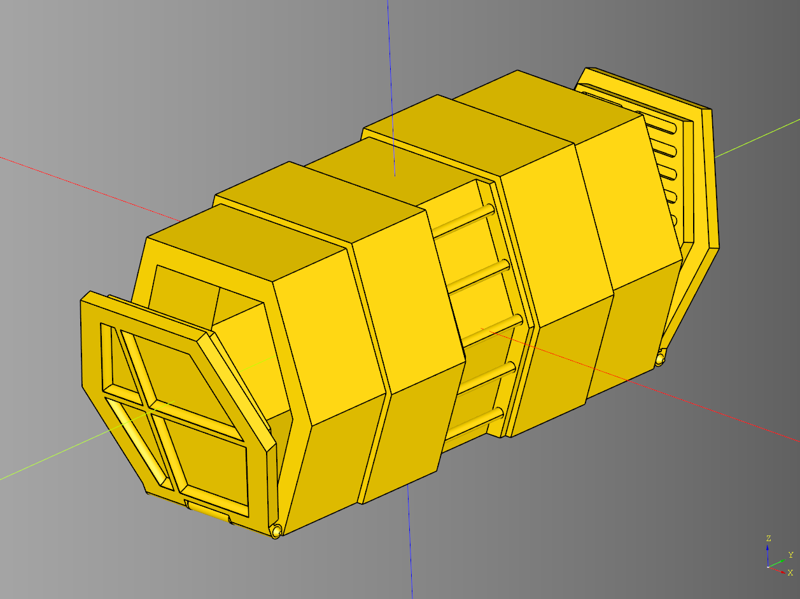

# cqportal
Python library for making portal and container terrain.

<br /><br />

### Example Portal Code

``` python
import cadquery as cq
from cqportal import Portal

bp_portal = Portal()
bp_portal.bp_frame.length = 150
bp_portal.bp_frame.width = 30
bp_portal.bp_frame.height = 150

bp_portal.render_base = False
bp_portal.render_ramps = True
bp_portal.ramp_push = 0
bp_portal.bp_ramp.width = 10

bp_portal.bp_hinge.rotate_deg = 0

bp_portal.make()


result_open = bp_portal.build()
#show_object(result_open)
cq.exporters.export(result_open, 'stl/portal_open.stl')
```

## Container
<br /><br />

### Example Container Code

``` python
import cadquery as cq
from cqportal import Container

bp_container = Container()
bp_container.bp_hinge.rotate_deg = -70

bp_container.make()

result = bp_container.build()
#show_object(result)
cq.exporters.export(result, 'stl/container.stl')
```

## Dependencies
* [CadQuery](https://github.com/CadQuery/cadquery)
* [cqMore](https://github.com/JustinSDK/cqMore)
* [cadqueryhelper](https://github.com/medicationforall/cadqueryhelper)
* [cqterrain](https://github.com/medicationforall/cqterrain)


### Installation
To install cqportal directly from GitHub, run the following `pip` command:

	pip install git+https://github.com/medicationforall/cqportal

**OR**

### Local Installation
From the cloned cqdome directory run.

	pip install ./
