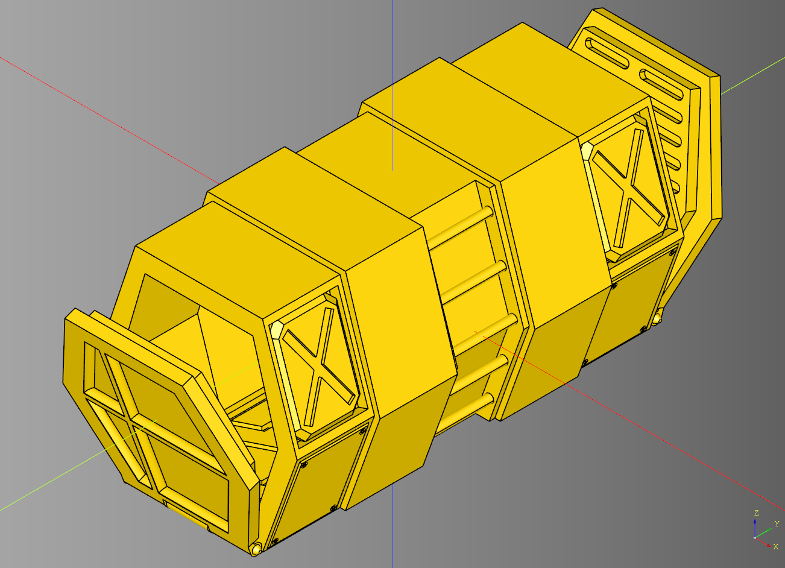
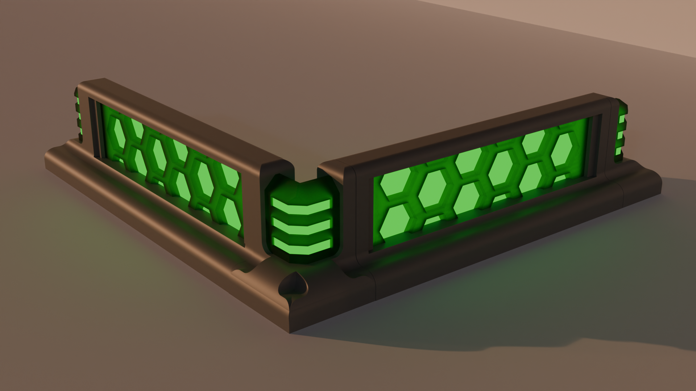

# cqportal
Python library for making portal, container, and shieldwall terrain.

---

## ARCHIVE
This repo is an archive, active development has been moved to [cqindustry](https://github.com/medicationforall/cqindustry)

---

## Portal
[](documentation/portal.md)<br /><br />


## Container
[](documentation/container.md)<br /><br />

## Shieldwall
[](documentation/shieldwall.md)<br /><br />

---

## Documention
* [Container](documentation/container.md)
* [Portal](documentation/portal.md)
* [Shieldwall](documentation/shieldwall.md)
  

## Changes
* [Changelog](./changes.md)

## Dependencies
* [CadQuery 2.x](https://github.com/CadQuery/cadquery)
* [cqterrain](https://github.com/medicationforall/cqterrain)

## Projects
* [Shipping Container Terrain](https://miniforall.com/shippingcontainer)
* [Shield Wall Terrain Set](https://miniforall.com/shieldwall)

---


### Installation
To install cqportal directly from GitHub, run the following `pip` command:

	pip install git+https://github.com/medicationforall/cqportal

**OR**

### Local Installation
From the cloned cqportal directory run.

	pip install ./


---

## Running Example Scripts

* All of the examples live in the [example directory](./example)
* The examples generated output stl's are written to the [stl directory](./stl).

[example_runner.py](example_runner.py) runs all examples.

``` bash
C:\Users\<user>\home\3d\cqportal>python example_runner.py
```

**OR**

### Running individual examples
* From the root of the project run one of the example scripts:
  
``` bash
C:\Users\<user>\home\3d\cqportal>python ./example/rampGreebled.py
```
