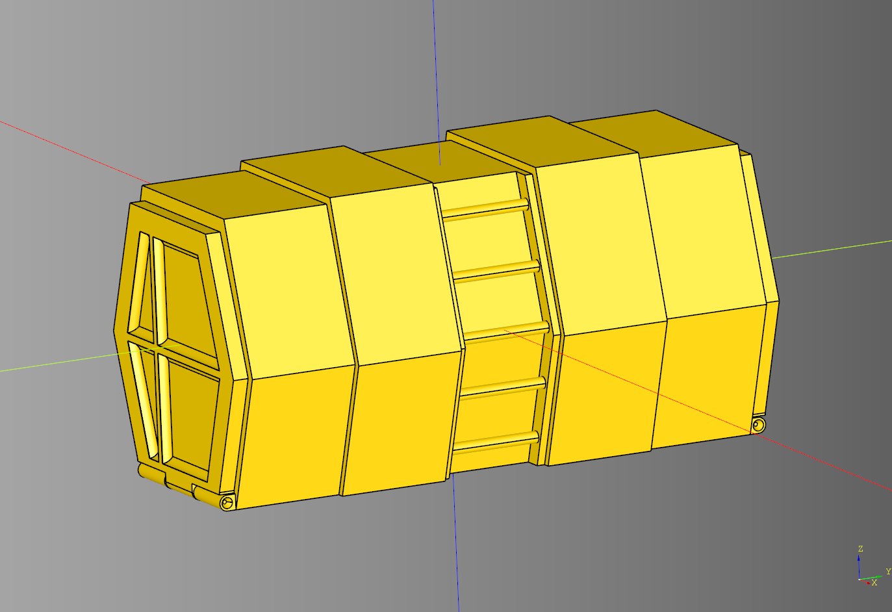
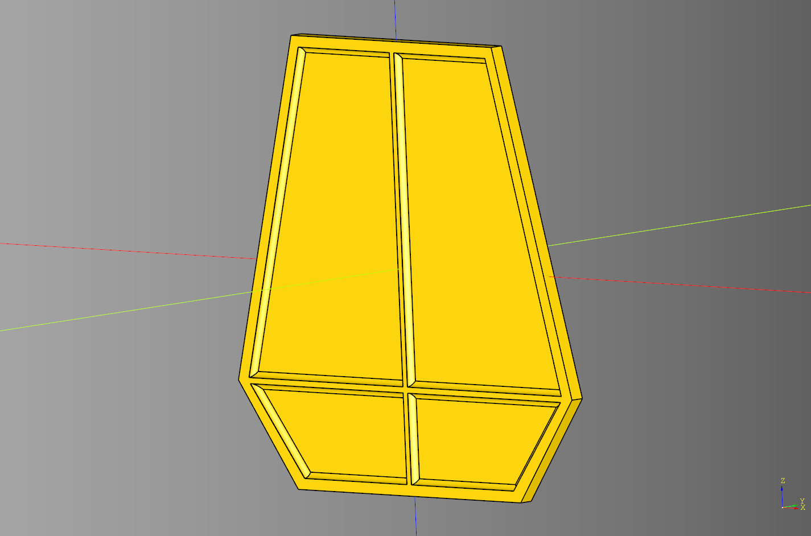
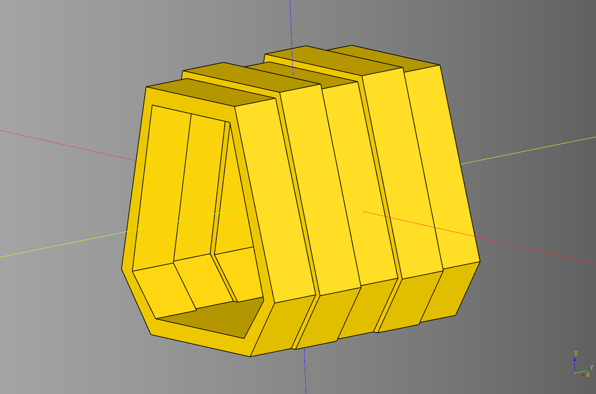

# Container Documentation

What if we took a portal and made it long? This is that.

---
## Container

Orchestration class for assembling a container. Inherits from [Portal](./portal.md#portal)

### parameters
* render_floor: bool
* render_ladder:bool

### blueprints
* bp_frame = ContainerFrame()
* bp_ramp = ContainerRamp()
* bp_ladder = ContainerLadder()
* bp_floor = Floor()

```python
import cadquery as cq
from cqportal.container import Container

bp_container = Container()
bp_container.bp_hinge.rotate_deg = -90

bp_container.make()

result = bp_container.build()
show_object(result)
```



* [source](../src/cqportal/container/Container.py)
* [example](../example/container/container.py)
* [stl](../stl/container.stl)

---
## Container Door

Inherits from [BaseCoffin](./portal.md#basecoffin)

### parameters
* cut_depth: float
* padding: float
* frame_width: float
* x_translate: float

### shapes
* door_cut: cq.Workplane|None
* cross: cq.Workplane|None

```python
import cadquery as cq
from cqportal.container import ContainerDoor

bp_door = ContainerDoor()
bp_door.length = 150
bp_door.width = 5
bp_door.height = 150
bp_door.top_length = 90
bp_door.base_length = 100
bp_door.base_offset = 35 # offset distance from the base of the ramp

bp_door.cut_depth = 2
bp_door.padding = 3
bp_door.frame_width = 2
bp_door.x_translate = 0
bp_door.make()
door = bp_door.build()

show_object(door)
```



* [source](../src/cqportal/container/ContainerDoor.py)
* [example](../example/container/containerDoor.py)
* [stl](../stl/container_door.stl)

---

## Container Frame

Inherits from [Frame](./portal.md#frame). 
Ovrrides the _make_frame method from Frame.

```python
import cadquery as cq
from cqportal.container import ContainerFrame

bp_frame = ContainerFrame()
bp_frame.length = 150
bp_frame.width = 150
bp_frame.height = 150
bp_frame.top_length = 90 # length at the top of the frame
bp_frame.base_length = 100 # length at the base of the frame
bp_frame.base_offset = 35 # offset distance from the center of the frame
bp_frame.side_inset = 8 # The amount the inset the side frames in relation to the center.
bp_frame.frame_size = 10 # distance from the outside wall and the inside wall.

bp_frame.make()
frame = bp_frame.build()

show_object(frame)
```



* [source](../src/cqportal/container/ContainerFrame.py)
* [example](../example/container/container_frame.py)
* [stl](../stl/container_frame.stl)


