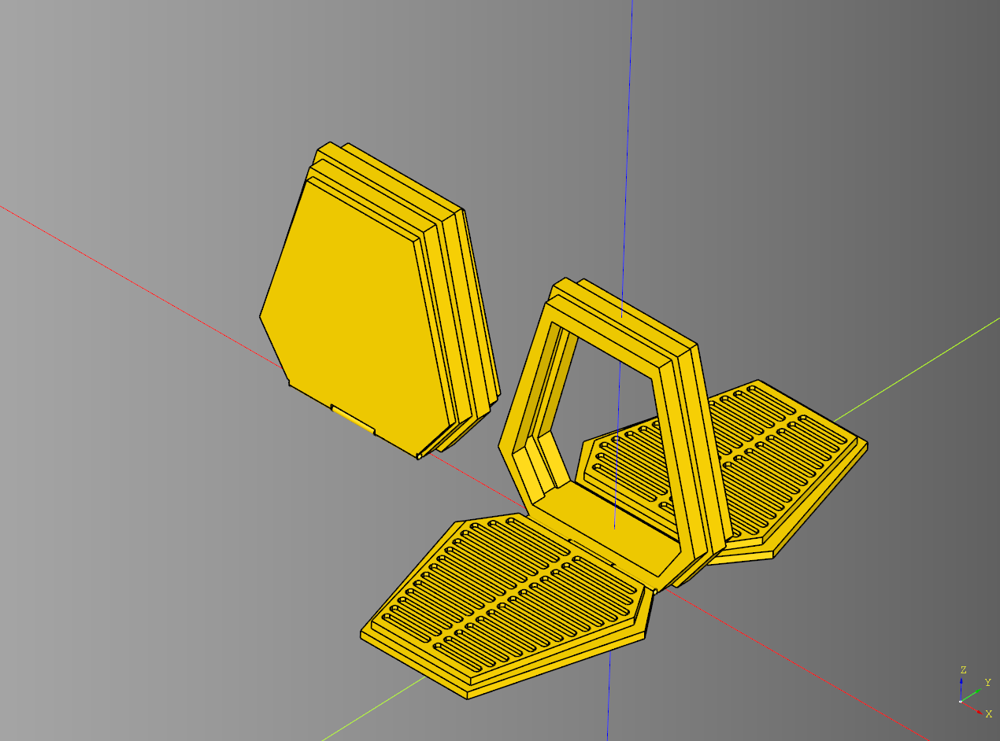
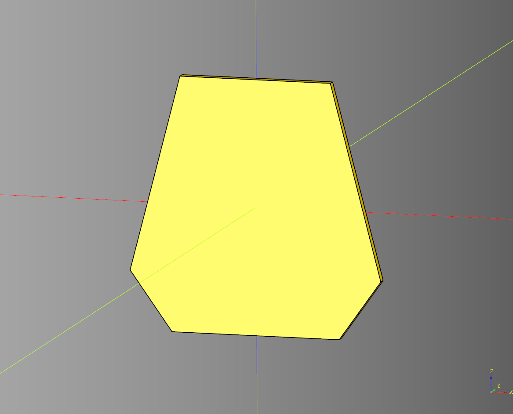
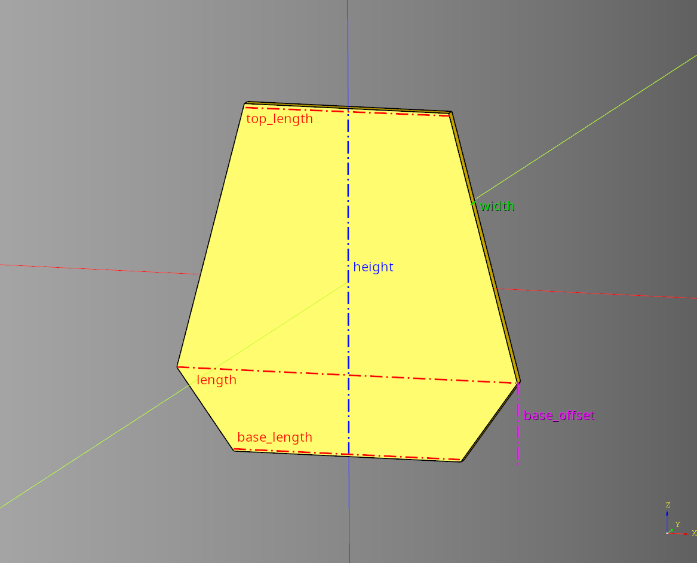
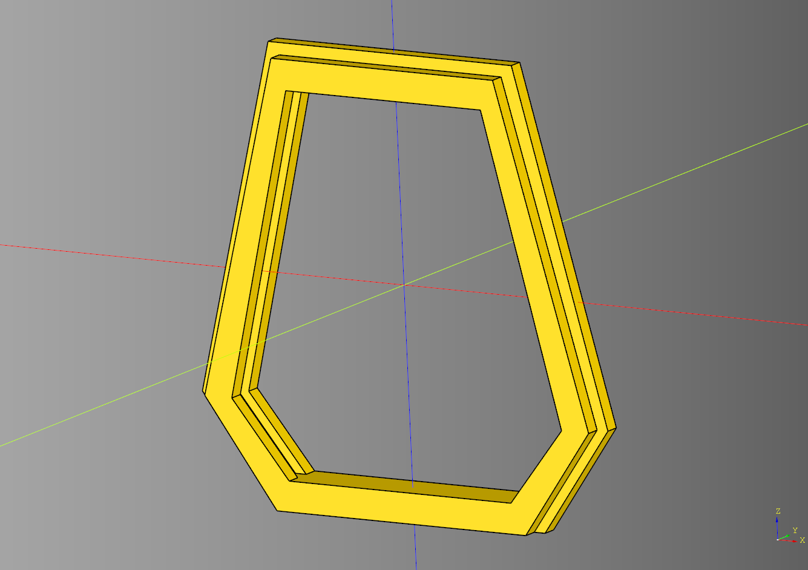
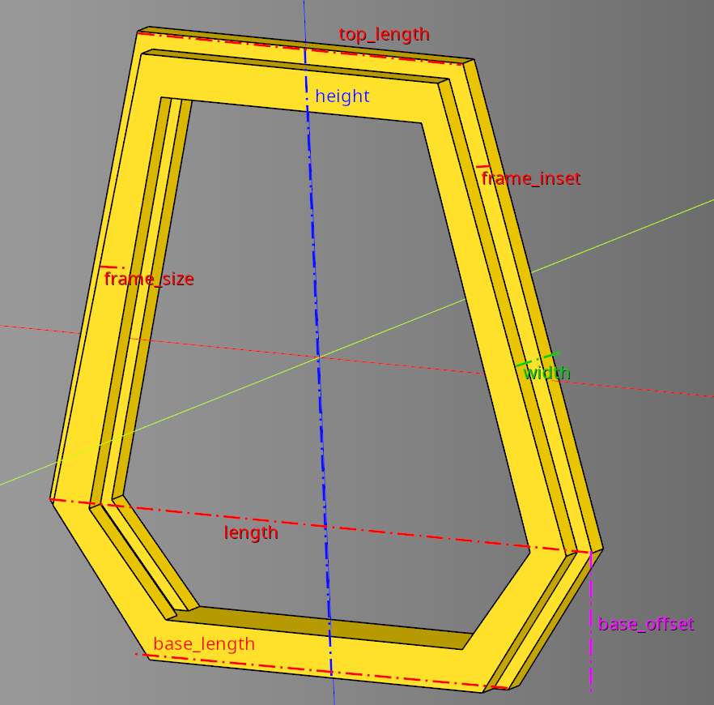
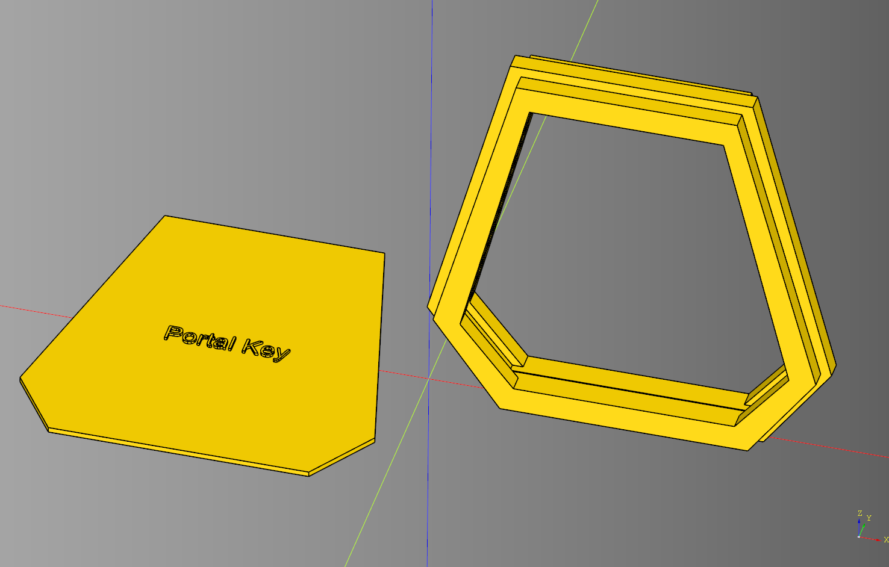
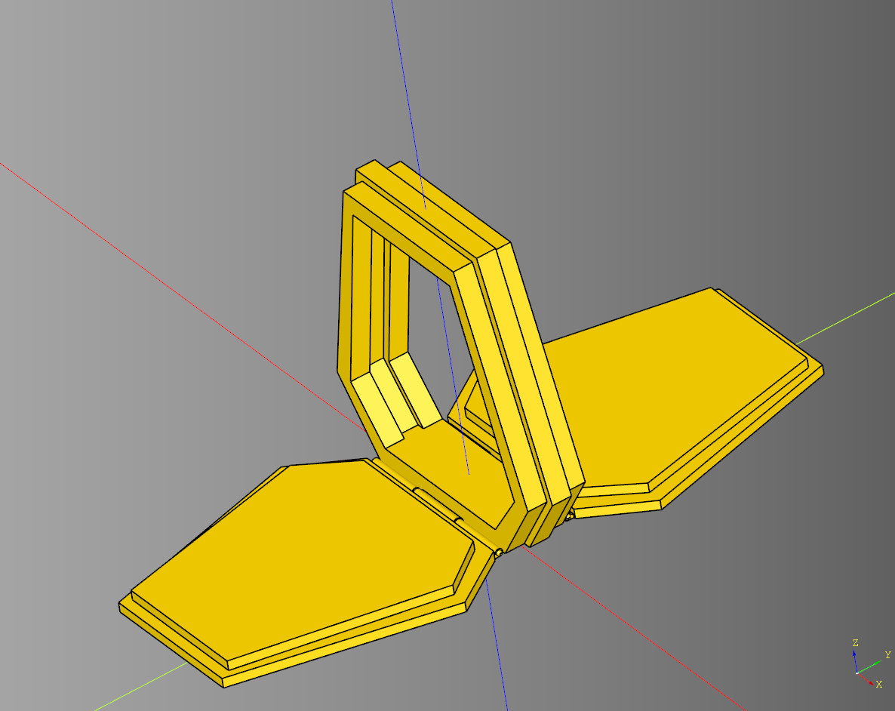

# cqportal - portal

Code for creating portal models with print in place hinges. 



---

## BaseCoffin





#### Parameters
* length = 150
* width = 5
* height = 150
* top_length = 90 # Length at the top of the shape
* base_length = 100 # Length at the base of the shape
* base_offset = 35 # offset distance from the base of the shape

#### Shape Parameters
* coffin - Base shape generated in the make lifecycle

### Example

``` python
import cadquery as cq
from cqportal.portal import BaseCoffin

bp = BaseCoffin()
bp.length = 150
bp.width = 5
bp.height = 150
bp.top_length = 90
bp.base_length = 100
bp.base_offset = 35 # offset distance from the base of the ramp
bp.make()
ex = bp.build()

show_object(ex)
```

#### Links
* [source](../src/cqportal/portal/BaseCoffin.py)
* [example](../example/base_coffin.py)
* [stl](../stl/base_coffin.stl)

---

## Frame





#### Parameters
* length = 150
* width = 15
* height = 150
* top_length = 90 # length at the top of the frame
* base_length = 100 # length at the base of the frame
* base_offset = 35 # offset distance from the center of the frame
* side_inset = 8 # The amount the inset the side frames in relation to the center.
* frame_size = 10 # distance from the outside wall and the inside wall.
* render_sides = True

#### Shape Parameters
* frame - stores the generated from from the make lifecycle

### Example

``` python
import cadquery as cq
from cqportal.portal import Frame

bp_frame = Frame()
bp_frame.length = 150
bp_frame.width = 15
bp_frame.height = 150
bp_frame.top_length = 90 # length at the top of the frame
bp_frame.base_length = 100 # length at the base of the frame
bp_frame.base_offset = 35 # offset distance from the center of the frame
bp_frame.side_inset = 8 # The amount the inset the side frames in relation to the center.
bp_frame.frame_size = 10 # distance from the outside wall and the inside wall.
bp_frame.make()

result = bp_frame.build()

show_object(result)
```

#### Links
* [source](../src/cqportal/portal/Frame.py)
* [example](../example/frame.py)
* [stl](../stl/frame.stl)

---

## Frame Window




#### Parameters
* length = 150
* width = 15
* height = 150
* top_length = 90 # length at the top of the frame
* base_length = 100 # length at the base of the frame
* base_offset = 35 # offset distance from the center of the frame
* side_inset = 8 # The amount the inset the side frames in relation to the center.
* frame_size = 10 # distance from the outside wall and the inside wall.
* render_sides = True # enable / disable the rendering of the sides
* window_cut_width = 0.4
* window_cut_padding = 1
* window_key_width = 2
* window_key_padding = 0.8
* window_key_text = "Portal Key"
* window_key_text_size = 10
* window_key_text_height = 1

The width of the center frame and the two side frame is calculated by dividing the width parameter by 3.

### Example

``` python
import cadquery as cq
from cqportal.portal import FrameWindow

bp_frame = FrameWindow()
bp_frame.length = 150
bp_frame.width = 20
bp_frame.height = 150
bp_frame.top_length = 90 # length at the top of the frame
bp_frame.base_length = 100 # length at the base of the frame
bp_frame.base_offset = 35 # offset distance from the center of the frame
bp_frame.side_inset = 8 # The amount the inset the side frames in relation to the center.
bp_frame.frame_size = 10 # distance from the outside wall and the inside wall.
bp_frame.render_sides = True

bp_frame.window_cut_width = 0.4
bp_frame.window_cut_padding = 1

bp_frame.window_key_width = 2
bp_frame.window_key_padding = 0.8

bp_frame.window_key_text = "Portal Key"
bp_frame.window_key_text_size = 10
bp_frame.window_key_text_height = 1
bp_frame.make()

result = bp_frame.build()

show_object(result.translate((bp_frame.length/2,0,bp_frame.height/2)))
show_object(bp_frame.window_cut_key.translate((-(bp_frame.length/2),0,0)))
```

#### Links
* [source](../src/cqportal/portal/FrameWindow.py)
* [example](../example/frame_window.py)
* [stl](../stl/frame_window.stl)

---

## Portal


#### Parameters
* render_base = True
* render_hinges = True
* ramp_push = 0
* hinge_segments = 3
* plate_spacer = 1

#### Blueprint Parameters
* bp_base = [PortalBase](#portal-base)()
* bp_frame = [Frame](#frame)()
* bp_ramp = [Ramp](#ramp)()
* bp_hinge = [PortalHinge](#portal-hinge)()

### Example
``` python
import cadquery as cq
from cqportal.portal import Portal

bp_portal = Portal()
bp_portal.bp_frame.length = 150
bp_portal.bp_frame.width = 30
bp_portal.bp_frame.height = 150

bp_portal.render_base = False
bp_portal.render_ramps = True
bp_portal.ramp_push = 0
bp_portal.bp_ramp.width = 10
bp_portal.make()


result_open = bp_portal.build()
show_object(result_open)
```
