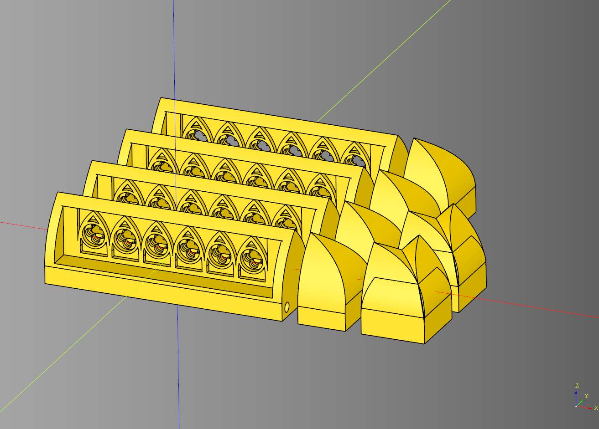
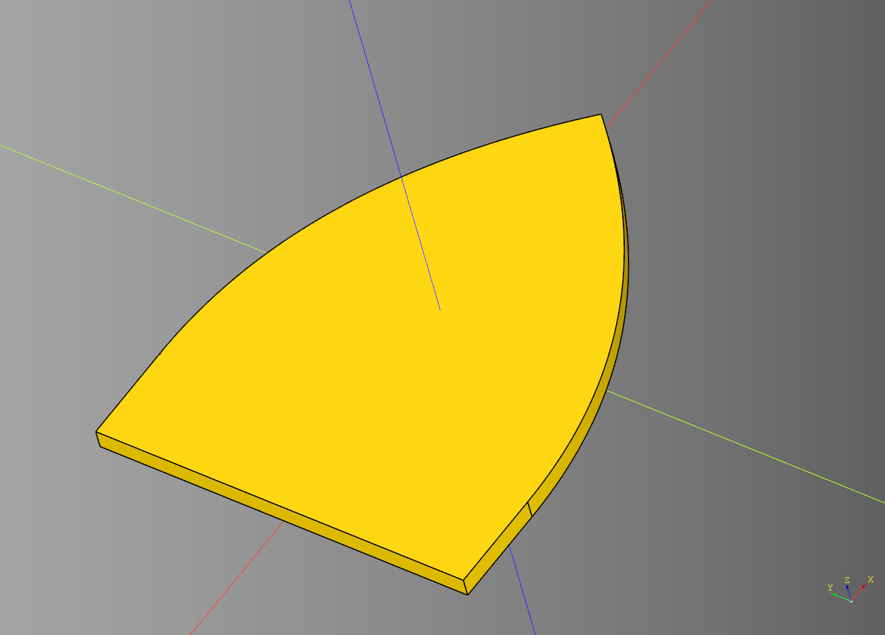

# Shieldwall Documentation

Sheildwall scatter terrain documentation.


---

## Arch Set
Helper class to generate a sert of walls that are gothic in style. 
Inherits off of [Set](#set).

### parameteres
#### Set parameteres
* straight_count: int
* padding: float
* height: float
* base_height: float
* magnet_padding_x: float
* corner_count: int
* end_cap_count: int
* end_cap_length: float

### blueprints
#### Set blueprints 
* straight_bp: [BaseWall](#base-wall) = [Straight](#straight)()
* end_bp: [BaseWall](#base-wall) = [EndCap](#end-cap)()
* corner_bp: [BaseWall](#base-wall) = [CornerConnector](#corner-connector)()

#### Arch Set blueprints 
* shape_bp: Base = [ArchShape](#arch-shape)()
* mesh_bp: Base = [GothicMesh](#gothic-mesh)()

```python
import cadquery as cq
from cqportal.shieldwall import ArchSet

arch_set_bp = ArchSet()
arch_set_bp.height=25
arch_set_bp.straight_count = 4
arch_set_bp.straight_bp.mesh_width = 6

arch_set_bp.end_bp.render_greeble = False
arch_set_bp.corner_bp.render_greeble = False
arch_set_bp.make()
arch_set = arch_set_bp.build()

show_object(arch_set)
```



* [source](../src/cqportal/shieldwall/ArchSet.py)
* [example](../example/shieldwall/archset.py)
* [stl](../stl/shieldwall_arch_set.stl)

---

## Arch Shape

Inherits from [BaseShape](#base-shape). This is just the archpointed code from cadqueryhelper with the orientation modified. 

### parameters
* length: float
* width: float
* base_height: float
* middle_width_inset: float

```python
import cadquery as cq
from cqportal.shieldwall import ArchShape

bp_shape = ArchShape()
bp_shape.length = 25
bp_shape.width = 20
bp_shape.base_height = 5
bp_shape.middle_width_inset = -6

bp_shape.make()

result = bp_shape.build().extrude(1)

show_object(result)
```



* [source](../src/cqportal/shieldwall/ArchShape.py)
* [example](../example/shieldwall/arch_shape.py)
* [stl](../stl/shieldwall_arch_shape.stl)

---

## Base Cut

