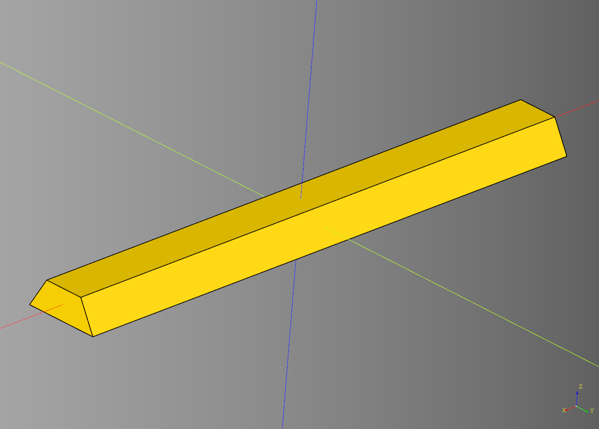
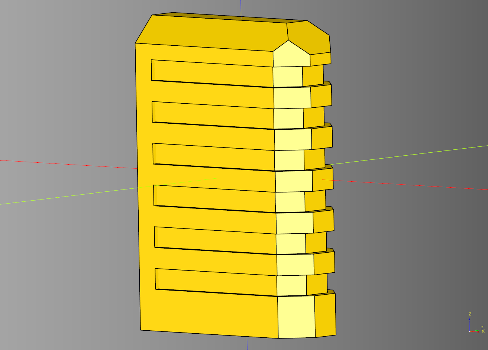
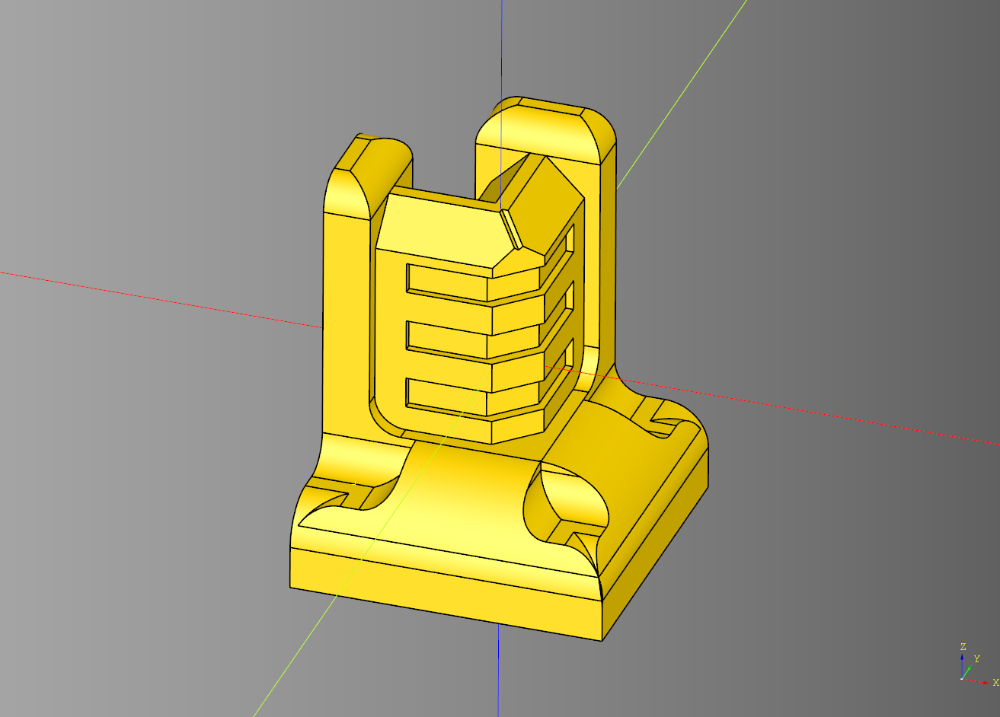

# Shieldwall Documentation

Sheildwall scatter terrain documentation.


---

## Arch Set
Helper class to generate a sert of walls that are gothic in style. 
Inherits off of [Set](#set).

### parameteres
#### Set parameteres
* straight_count: int
* padding: float
* height: float
* base_height: float
* magnet_padding_x: float
* corner_count: int
* end_cap_count: int
* end_cap_length: float

### blueprints
#### Set blueprints 
* straight_bp: [BaseWall](#base-wall) = [Straight](#straight)()
* end_bp: [BaseWall](#base-wall) = [EndCap](#end-cap)()
* corner_bp: [BaseWall](#base-wall) = [CornerConnector](#corner-connector)()

#### Arch Set blueprints 
* shape_bp: Base = [ArchShape](#arch-shape)()
* mesh_bp: Base = [GothicMesh](#gothic-mesh)()

```python
import cadquery as cq
from cqportal.shieldwall import ArchSet

arch_set_bp = ArchSet()
arch_set_bp.height=25
arch_set_bp.straight_count = 4
arch_set_bp.straight_bp.mesh_width = 6

arch_set_bp.end_bp.render_greeble = False
arch_set_bp.corner_bp.render_greeble = False
arch_set_bp.make()
arch_set = arch_set_bp.build()

show_object(arch_set)
```


* [source](../src/cqportal/shieldwall/ArchSet.py)
* [example](../example/shieldwall/archset.py)
* [stl](../stl/shieldwall_arch_set.stl)

---

## Arch Shape

Inherits from [BaseShape](#base-shape). This is just the archpointed code from cadqueryhelper with the orientation modified. 

### parameters
* length: float
* width: float
* base_height: float
* middle_width_inset: float

```python
import cadquery as cq
from cqportal.shieldwall import ArchShape

bp_shape = ArchShape()
bp_shape.length = 25
bp_shape.width = 20
bp_shape.base_height = 5
bp_shape.middle_width_inset = -6

bp_shape.make()

result = bp_shape.build().extrude(1)

show_object(result)
```


* [source](../src/cqportal/shieldwall/ArchShape.py)
* [example](../example/shieldwall/arch_shape.py)
* [stl](../stl/shieldwall_arch_shape.stl)

---

## Base Cut

Removed from the bottom of the shieldwall components.

### parameters
* length: float
* width: float
* height: float
* angle: float

```python
import cadquery as cq
from cqportal.shieldwall import BaseCut

bp_base_cut = BaseCut()
bp_base_cut.length = 75
bp_base_cut.width = 10
bp_base_cut.height = 4
bp_base_cut.angle = 30

bp_base_cut.make()

result = bp_base_cut.build()

show_object(result)
```



* [source](../src/cqportal/shieldwall/BaseCut.py)
* [example](../example/shieldwall/base_cut.py)
* [stl](../stl/shieldwall_base_cut.stl)
  
---

## Base Greeble
Psuedo Interface defines the minimal properties available for anything that inherits off of BaseGreeble.

### parameters
* length: float
* width: float
* height: float
* grill_padding_left: float

### shapes
* body: cq.Workplane|None
* grill_set: cq.Workplane|None
* grill_set_internal: cq.Workplane|None

<em></em>
* [source](../src/cqportal/shieldwall/BaseGreeble.py)


---
## Base Magnets
Psuedo Interface defines the minimal properties available for anything that inherits off of BaseMagnets.

### parameters
* distance: float
* pip_height: float
* pip_radius: float

### shapes
* pips: cq.Workplane|None

<em></em>
* [source](../src/cqportal/shieldwall/BaseMagnets.py)

---

## Base Mesh
Psuedo Interface defines the minimal properties available for anything that inherits off of BaseMesh.

### parameters
* length: float
* width: float
*  height: float

### shapes
* tile: cq.Workplane|None

<em></em>
* [source](../src/cqportal/shieldwall/BaseMesh.py)

---

## Base Shape
Psuedo Interface defines the minimal properties available for anything that inherits off of BaseShape.

### parameters
* length: float
* width: float
* base_height: float
* middle_width_inset: float

<em></em>
* [source](../src/cqportal/shieldwall/BaseShape.py)


---

### Base Wall
Psuedo Interface defines the minimal properties available for anything that inherits off of BaseStraight.

### pamareters
* length: float
* height: float
* width: float
* height: float
* base_height: float
* magnet_padding_x: float
* mesh_width: float
* render_greeble: bool

### blueprints
* shape_bp: [BaseShape](#base-shape)
* mesh_bp: [BaseMesh](#base-mesh)
* magnets_bp: [BaseMagnets](#base-magnets)
* base_cut_bp: [BaseCut](#base-cut)

<em></em>
* [source](../src/cqportal/shieldwall/BaseWall.py)
---

### Cap Greeble
Inherits from [BaseGreeble](#base-greeble).

### parameters
* length: float
* width: float
* height: float
* top_fillet: float
* side_fillet: float
* operation: Literal['chamfer', 'fillet'] = 'chamfer'
* render_grill: bool
* grill_height: float
* grill_padding_top: float
* grill_padding_left: float
* grill_margin: float

### shapes
* body: cq.Workplane|None
* grill: cq.Workplane|None
* grill_internal: cq.Workplane|None
* grill_set: cq.Workplane|None
* grill_set_internal: cq.Workplane|None

``` python
import cadquery as cq
from cqportal.shieldwall import CapGreeble

bp_cap = CapGreeble()

bp_cap.length = 20
bp_cap.width = 8
bp_cap.height = 30
bp_cap.top_fillet = 2.9
bp_cap.side_fillet = 2.5
bp_cap.operation = 'chamfer'

bp_cap.render_grill = True
bp_cap.grill_height = 2
bp_cap.grill_padding_top = 1
bp_cap.grill_padding_left = 2
bp_cap.grill_margin = .5

bp_cap.make()

result = bp_cap.build()

show_object(result)
```



* [source](../src/cqportal/shieldwall/CapGreeble.py)
* [example](../example/shieldwall/cap_greeble.py)
* [stl](../stl/shieldwall_cap_greeble.stl)

---

## Corner Connector

Extrudes two copies of the shape_bp at a 90 degree angle. Inherits from [BaseWall](#base-wall)

### properties
* length: float
* width: float
* height: float
* base_height: float
* render_magnets: bool
* magnet_padding: float
* magnet_padding_x: float
* side_margin: float
* side_height: float
* top_height: float
* cut_width: float
* middle_width_inset: float
* render_greeble: bool
* greeble_padding_y: float
        
### blueprints
* shape_bp: [BaseShape](#base-shape) = [ShieldShape](#shield-shape)()
* greeble_bp: [BaseGreeble](#base-greeble) = [CapGreeble](#cap-greeble)()
* magnets_bp: [BaseMagnets](#base-magnets) = [Magnets](#magnets)()
        
### shapes
* shape: cq.Workplane|None
* connector: cq.Workplane|None
* end_cap: cq.Workplane|None
* greeble: cq.Workplane|None

```python
import cadquery as cq
from cqportal.shieldwall import CornerConnector

corner_bp = CornerConnector()
corner_bp.length = 20
corner_bp.width = 20
corner_bp.height = 25

corner_bp.base_height = 5.6

corner_bp.render_magnets = True
corner_bp.magnet_padding = 1
corner_bp.magnet_padding_x = 2

corner_bp.side_margin = -2
corner_bp.side_height = 1
corner_bp.top_height = 2

corner_bp.cut_width = 3
corner_bp.middle_width_inset = -6

corner_bp.render_greeble = True
corner_bp.greeble_padding_y = 1

corner_bp.make()
corner_ex = corner_bp.build()
corner_ex_assembly = corner_bp.build_assembly()

show_object(corner_ex)
```



* [source](../src/cqportal/shieldwall/CornerConnector.py)
* [example](../example/shieldwall/corner_connector.py)
* [stl](../stl/shieldwall_corner_connector.stl)